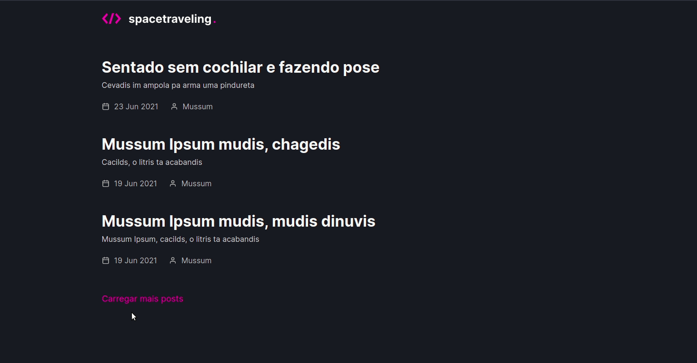

<h1 align="center">
  
</h1>

<p align="center">
  <a href="#tecnologias">Tecnologias</a> |
  <a href="#execução">Execução</a> |
  <a href="#spacetraveling">Spacetraveling</a> |
  <a href="#licença">Licença</a>
</p>

<p align="center">
  

  
</p>

# Spacetraveling

O Spacetraveling é uma aplicação de listagem de posts. A aplicação foi criada a partir de um dos desafios do Ignite da Rocketseat.

<p align="center">
  
</p>

## Tecnologias

Esse projeto foi desenvolvido utilizando as seguintes tecnologias:

- TypeScript
- ReactJS
- NextJS
- SASS
- Prismic CMS

## Execução

Crie o arquivo .env.local na pasta do projeto. (Utilize o env-example.local como base). Após criar o arquivo execute o comando:

```bash
yarn dev
```

## Licença

Esse projeto está sob a licença MIT. Veja o arquivo [LICENSE](.github/LICENSE.md) para mais detalhes.
